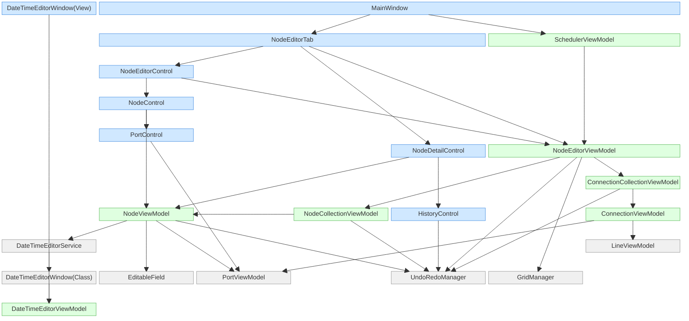

# WcmScheduler

## 概要
ノードベースのスケジュール管理ツールです

## MainApplicationフォルダの構造
```plaintext
📂 MainApplication
├── 📂 Helpers
│   └── 📄 VisualTreeUtils.cs                # WPF の VisualTree を探索・操作するユーティリティ
│
├── 📂 Infrastructure
│   ├── 📄 FileService.cs                    # ファイル読込・保存
│   ├── 📄 IFileService.cs                   # ファイル読込・保存のインターフェース
│   ├── 📄 IJsonSerializerService.cs         # JSONのシリアライザのインターフェース
│   └── 📄 JsonSerializerService.cs          # JSONのシリアライザ（シリアライズ/デシリアライズ）
│
├── 📂 Mapper
│   ├── 📄 ConnectionMapper.cs               # 接続線情報のViewModel⇔Model相互変換
│   ├── 📄 NodeEditorMapper.cs               # タスク編集機能(NodeEditor/TaskEditor)のViewModel⇔Model相互変換
│   └── 📄 NodeMapper.cs          　　　　　　# ノード情報のViewModel⇔Model相互変換
│
├── 📂 Models
│   └── 📂 SaveData                          # 保存するデータのモデル
│       ├── 📄 ConnectionDataModel.cs        # 接続線管理用情報
│       ├── 📄 NodeDataModel.cs              # ノード管理用情報
│       ├── 📄 NodeDetailsDataModel.cs       # ノードごとの詳細情報
│       ├── 📄 PortDataModel.cs              # ノード内ポート管理用情報
│       ├── 📄 PositionDataModel.cs          # 座標管理用情報
│       ├── 📄 RootSaveData.cs               # 保存するデータのルート情報
│       └── 📄 TaskEditorDataModel.cs        # タスク編集機能についての情報
│
├── 📂 Properties
│   ├── 📄 AssemblyInfo.cs                   # アセンブリメタ情報
│   ├── 📄 Resources.Designer.cs             # リソースの自動生成コード
│   ├── 📄 Resources.resx                    # 文字列・画像などのリソース
│   ├── 📄 Settings.Designer.cs              # 設定の自動生成コード
│   └── 📄 Settings.settings                 # アプリ設定
│
├── 📂 ViewModels
│   ├── 📂 Actions                           # Undo/Redo 用の操作履歴アクション
│   │   ├── 📄 AddConnectionAction.cs        # 接続線追加の Undo/Redo
│   │   ├── 📄 AddNodeAction.cs              # ノード追加の Undo/Redo
│   │   ├── 📄 DeleteConnectionAction.cs     # 接続線削除の Undo/Redo
│   │   ├── 📄 DeleteNodeAction.cs           # ノード削除の Undo/Redo
│   │   ├── 📄 EditNodePropertyAction.cs     # ノードプロパティ編集の Undo/Redo
│   │   └── 📄 MoveNodeAction.cs             # ノード移動の Undo/Redo
│   │
│   ├── 📂 Converters                        # XAML バインディング用コンバータ
│   │   ├── 📄 BoolToVisibilityConverter.cs  # bool → Visibility
│   │   ├── 📄 DateTimeDisplayConverter.cs   # DateTime? → 表示文字列
│   │   ├── 📄 DisplayNameConverter.cs       # DisplayName 属性 → 表示名
│   │   ├── 📄 PortColorConverter.cs         # ポート種別 → 色
│   │   └── 📄 SelectionBrushConverter.cs    # 選択状態 → ブラシ
│   │
│   ├── 📂 Core                              # 基盤ロジック（UI 非依存）
│   │   ├── 📄 EditableField.cs              # 編集フィールドの共通ロジック（遅延コミット）
│   │   ├── 📄 GridManager.cs                # 論理座標系・ズーム・パン管理
│   │   └── 📄 UndoRedoManager.cs            # Undo/Redo の中枢
│   │
│   ├── 📂 Service
│   │   ├── 📄 DateTimeEditorService.cs      # 日時編集ダイアログを開くサービス（UI 呼び出し）
│   │   └── 📄 IDateTimeEditorService.cs     # 日時編集サービスのインターフェース
│   │
│   ├── 📄 ConnectionCollectionViewModel.cs  # 接続線の一覧管理
│   ├── 📄 ConnectionViewModel.cs            # 接続線1本の状態
│   ├── 📄 DateTimeEditorViewModel.cs        # 日時編集ダイアログの ViewModel（UI 入力ロジック）
│   ├── 📄 LineViewModel.cs                  # 線分の描画情報（接続線の補助）
│   ├── 📄 NodeCollectionViewModel.cs        # ノード一覧管理（生成・削除・選択）
│   ├── 📄 NodeEditorViewModel.cs            # ノードエディタ全体の状態管理（ズーム・パン・Undo/Redo）
│   ├── 📄 NodeViewModel.cs                  # ノード1個の状態・編集ロジック
│   ├── 📄 PortViewModel.cs                  # ポート（入出力端子）の状態
│   ├── 📄 RelayCommand.cs                   # ICommand 実装（MVVM の基本）
│   └── 📄 SchedulerViewModel.cs             # アプリケーション全体の状態管理
│
├── 📂 Views
│   ├── 📂 Behaviors                         # XAML の動作拡張
│   │   ├── 📄 ListBoxAutoScrollBehavior.cs  # ListBox の自動スクロール
│   │   └── 📄 ListBoxItemDoubleClickBehavior.cs # ダブルクリック動作
│   │
│   ├── 📂 NodeEditorTab                    # ノードエディタ UI 一式
│   │   ├── 📂 Controls
│   │   │   ├── 📄 HistoryControl.xaml       # Undo/Redo 履歴表示
│   │   │   ├── 📄 HistoryControl.xaml.cs
│   │   │   ├── 📄 NodeControl.xaml          # ノードの見た目
│   │   │   ├── 📄 NodeControl.xaml.cs
│   │   │   ├── 📄 NodeDetailControl.xaml    # ノード詳細（プロパティ編集）
│   │   │   ├── 📄 NodeDetailControl.xaml.cs
│   │   │   ├── 📄 NodeEditorControl.xaml    # エディタ全体の UI
│   │   │   ├── 📄 NodeEditorControl.xaml.cs
│   │   │   ├── 📄 PortControl.xaml          # ポートの見た目
│   │   │   └── 📄 PortControl.xaml.cs
│   │   ├── 📄 NodeDetailTemplateSelector.cs # ノード詳細のテンプレート切り替え
│   │   ├── 📄 NodeEditorTab.xaml            # タブ UI
│   │   └── 📄 NodeEditorTab.xaml.cs
│   │
│   ├── 📄 BindingProxy.cs                   # XAML のバインディング補助
│   ├── 📄 DateTimeEditorWindow.xaml         # 日時編集ダイアログ（View）
│   └── 📄 DateTimeEditorWindow.xaml.cs      # 日時編集ダイアログのコードビハインド（UI ロジック）
│
├── 📄 App.config                            # アプリ設定
├── 📄 App.xaml                              # アプリケーション定義
├── 📄 App.xaml.cs                           # アプリ起動ロジック
├── 📄 MainApplication.csproj                # プロジェクトファイル
├── 📄 MainWindow.xaml                       # メインウィンドウ
├── 📄 MainWindow.xaml.cs                    # メインウィンドウのコードビハインド
└── 📄 packages.config                       # NuGet パッケージ管理
```

## ノードエディタのクラス依存関係図
