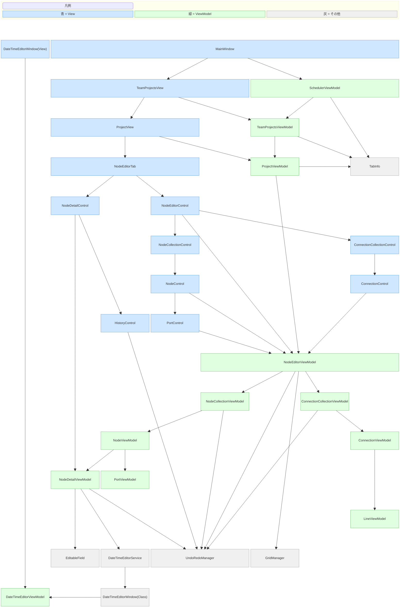

# WcmScheduler

## 概要

ノードベースのスケジュール管理ツールです

## MainApplicationフォルダの構造

```plaintext
📂 MainApplication
├── 📂 Helpers
│   └── 📄 VisualTreeUtils.cs                          # WPFのVisualTreeを探索・操作するユーティリティ
│
├── 📂 Infrastructure
│   ├── 📄 FileService.cs                              # ファイル読込・保存
│   ├── 📄 IFileService.cs                             # ファイル読込・保存のインターフェース
│   ├── 📄 IJsonSerializerService.cs                   # JSONのシリアライザのインターフェース
│   └── 📄 JsonSerializerService.cs                    # JSONのシリアライザ(シリアライズ/デシリアライズ)
│
├── 📂 Mappers
│   ├── 📄 ConnectionMapper.cs                         # 接続線情報のViewModel⇔Model相互変換
│   ├── 📄 NodeEditorMapper.cs                         # タスク編集機能(NodeEditor/TaskEditor)のViewModel⇔Model相互変換
│   └── 📄 NodeMapper.cs                               # ノード情報のViewModel⇔Model相互変換
│
├── 📂 Models
│   ├── 📂 SaveData                                    # 保存するデータのモデル
│   │   ├── 📄 ConnectionDataModel.cs                  # 接続線管理用情報
│   │   ├── 📄 NodeDataModel.cs                        # ノード管理用情報
│   │   ├── 📄 NodeDetailsDataModel.cs                 # ノードごとの詳細情報
│   │   ├── 📄 PortDataModel.cs                        # ノード内ポート管理用情報
│   │   ├── 📄 PositionDataModel.cs                    # 座標管理用情報
│   │   ├── 📄 RootSaveDataModel.cs                    # 保存するデータのルート情報
│   │   └── 📄 TaskEditorDataModel.cs                  # タスク編集機能についての情報
│   └── 📂 SaveData                                    # 設定関連のモデル
│       └── 📄 ThemeSettingModel.cs                    # テーマ設定情報
│
├── 📂 Themes                                          # テーマ関連リソース
│   ├── 📂 schema                                      # JSONスキーマ
│   │   └── 📄 ThemeSchema.json                        # テーマ設定JSONのスキーマ
│   ├── 📄 Dark.json                                   # ダークモード向けデフォルトテーマ
│   └── 📄 Light.json                                  # ライトモード向けデフォルトテーマ
│
├── 📂 Properties
│   ├── 📄 AssemblyInfo.cs                             # アセンブリメタ情報
│   ├── 📄 Resources.Designer.cs                       # リソースの自動生成コード
│   ├── 📄 Resources.resx                              # 文字列・画像などのリソース
│   ├── 📄 Settings.Designer.cs                        # 設定の自動生成コード
│   └── 📄 Settings.settings                           # アプリ設定
│
├── 📂 ViewModels
│   ├── 📂 Actions                                     # Undo/Redo用の操作履歴アクション
│   │   ├── 📄 AddConnectionAction.cs                  # Undo/Redoアクション：接続線追加
│   │   ├── 📄 AddNodeAction.cs                        # Undo/Redoアクション：ノード追加
│   │   ├── 📄 DeleteConnectionAction.cs               # Undo/Redoアクション：接続線削除
│   │   ├── 📄 DeleteNodeAction.cs                     # Undo/Redoアクション：ノード削除
│   │   ├── 📄 EditNodeDetailPropertyAction.cs         # Undo/Redoアクション：ノード詳細プロパティ編集
│   │   └── 📄 MoveNodeAction.cs                       # Undo/Redoアクション：ノード移動
│   │
│   ├── 📂 Converters                                  # XAMLバインディング用コンバータ
│   │   ├── 📄 BoolToVisibilityConverter.cs            # bool             → Visibility
│   │   ├── 📄 DateTimeDisplayConverter.cs             # DateTime?        → 表示文字列
│   │   ├── 📄 DisplayNameConverter.cs                 # DisplayName 属性 → 表示名
│   │   └── 📄 PortColorConverter.cs                   # ポート種別       → 色
│   │
│   ├── 📂 Core                                        # 基盤ロジック(UI非依存)
│   │   ├── 📄 EditableField.cs                        # 編集フィールドの共通ロジック(遅延コミット)
│   │   ├── 📄 GridManager.cs                          # 論理座標系・ズーム・パン管理
│   │   ├── 📄 PointEx.cs                              # 座標計算用Point型拡張
│   │   ├── 📄 RelayCommand.cs                         # ICommand 実装(MVVMの基本)
│   │   ├── 📄 TabInfo.cs                              # タブ管理用情報
│   │   ├── 📄 ThemeManager.cs                         # テーマ設定管理情報
│   │   ├── 📄 UndoRedoManager.cs                      # Undo/Redo管理情報
│   │   └── 📄 ViewModelBase.cs                        # プロパティ編集を伴うViewModelの基底クラス
│   │
│   ├── 📂 ProjectModel
│   │   ├── 📄 ConnectionCollectionViewModel.cs        # 接続線の一覧管理
│   │   ├── 📄 ConnectionViewModel.cs                  # 接続線1本の状態
│   │   ├── 📄 LineViewModel.cs                        # 線分の描画情報(接続線の補助)
│   │   ├── 📄 NodeCollectionViewModel.cs              # ノード一覧管理(生成・削除・選択)
│   │   ├── 📄 NodeDetailViewModel.cs                  # ノードの詳細情報(編集可能プロパティ)
│   │   ├── 📄 NodeEditorViewModel.cs                  # ノードエディタ全体の状態管理(ズーム・パン・Undo/Redo)
│   │   ├── 📄 NodeViewModel.cs                        # ノード1個の状態・編集ロジック
│   │   ├── 📄 PortViewModel.cs                        # ポート(入出力端子)の状態
│   │   └── 📄 ProjectViewModel.cs                     # 1つのプロジェクト全体の管理
│   │
│   ├── 📂 ThemeModel
│   │   ├── 📄 ThemeMenuItemViewModel.cs               # テーマ関連メニューの一覧管理
│   │
│   ├── 📂 Service
│   │   ├── 📄 DateTimeEditorService.cs                # 日時編集ダイアログを開くサービス(UI 呼び出し)
│   │   └── 📄 IDateTimeEditorService.cs               # 日時編集サービスのインターフェース
│   │
│   ├── 📄 DateTimeEditorViewModel.cs                  # 日時編集ダイアログのViewModel(UI入力ロジック)
│   ├── 📄 SchedulerViewModel.cs                       # アプリケーション全体の状態管理
│   └── 📄 TeamProjectsViewModel.cs                    # チーム内の複数のプロジェクトの管理
│
├── 📂 Views
│   ├── 📂 Behaviors                                   # XAML の動作拡張
│   │   ├── 📄 ListBoxAutoScrollBehavior.cs            # ListBoxの自動スクロール
│   │   └── 📄 ListBoxItemDoubleClickBehavior.cs       # ダブルクリック動作
│   │
│   ├── 📂 NodeEditorTab                               # ノードエディタUI一式
│   │   ├── 📂 Controls
│   │   │   ├── 📄 ConnectionCollectionControl.xaml    # 接続線一覧管理
│   │   │   ├── 📄 ConnectionCollectionControl.xaml.cs
│   │   │   ├── 📄 ConnectionControl.xaml              # 接続線の見た目
│   │   │   ├── 📄 ConnectionControl.xaml.cs
│   │   │   ├── 📄 GridControl.xaml                    # グリッド・原点軸の見た目
│   │   │   ├── 📄 GridControl.xaml.cs
│   │   │   ├── 📄 HistoryControl.xaml                 # Undo/Redo履歴表示
│   │   │   ├── 📄 HistoryControl.xaml.cs
│   │   │   ├── 📄 NodeCollectionControl.xaml          # ノード一覧管理
│   │   │   ├── 📄 NodeCollectionControl.xaml.cs
│   │   │   ├── 📄 NodeControl.xaml                    # ノードの見た目
│   │   │   ├── 📄 NodeControl.xaml.cs
│   │   │   ├── 📄 NodeDetailControl.xaml              # ノード詳細(プロパティ編集)
│   │   │   ├── 📄 NodeDetailControl.xaml.cs
│   │   │   ├── 📄 NodeEditorControl.xaml              # エディタ全体のUI
│   │   │   ├── 📄 NodeEditorControl.xaml.cs
│   │   │   ├── 📄 PortControl.xaml                    # ポートの見た目
│   │   │   └── 📄 PortControl.xaml.cs
│   │   ├── 📄 NodeDetailTemplateSelector.cs           # ノード詳細のテンプレート切り替え
│   │   ├── 📄 NodeEditorTab.xaml                      # タブUI
│   │   └── 📄 NodeEditorTab.xaml.cs
│   │
│   ├── 📄 BindingProxy.cs                             # XAMLのバインディング補助
│   ├── 📄 DateTimeEditorWindow.xaml                   # 日時編集ダイアログ(View)
│   ├── 📄 DateTimeEditorWindow.xaml.cs                # 日時編集ダイアログのコードビハインド(UIロジック)
│   ├── 📄 ProjectView.xaml                            # プロジェクト単体情報
│   ├── 📄 ProjectView.xaml.cs
│   ├── 📄 TeamProjectsView.xaml                       # チーム内プロジェクト情報(複数のプロジェクトの管理用View)
│   └── 📄 TeamProjectsView.xaml.cs
│ 
├── 📄 App.xaml                                        # アプリケーション定義
├── 📄 App.xaml.cs                                     # アプリ起動ロジック
├── 📄 AssemblyInfo.cs                                 # アセンブリ情報
├── 📄 MainApplication.csproj                          # プロジェクトファイル
├── 📄 MainWindow.xaml                                 # メインウィンドウ
└── 📄 MainWindow.xaml.cs                              # メインウィンドウのコードビハインド
```

## ノードエディタのクラス依存関係図


